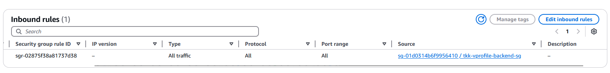
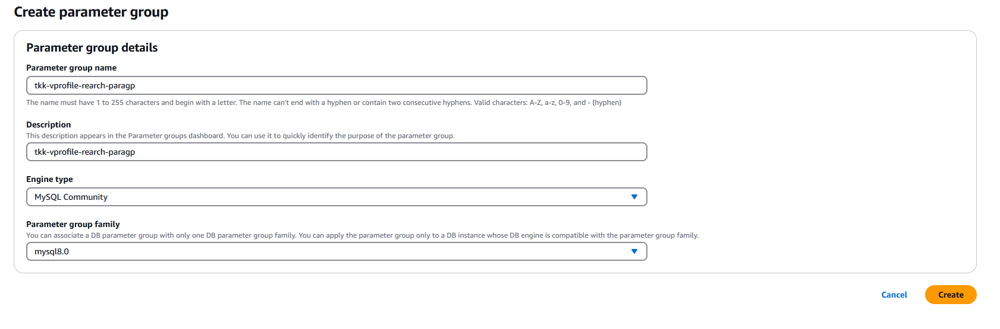
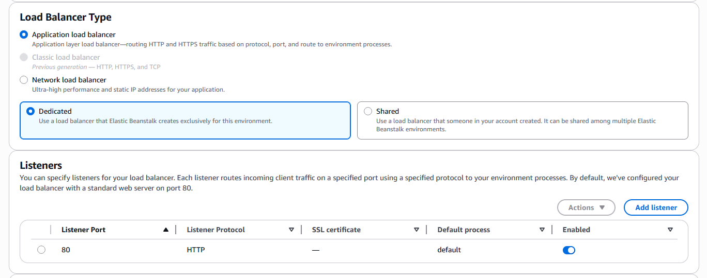

# Rearchitecting-Web-App-on-AWS-Cloud-PAAS-SAAS


## 1. Create Security Group and Key Pair

- Create inbound rule for all traffic from SG of that created SG because of internal traffic only




## 2. Create RDS

#### 2.1 Create Parameter Group




#### 2.2 Create Subnet Group

- Use private subnet

#### 2.3 Create Database


- Add DB instance identifier

- Use micro type

- Use created resources for VPC,DB Subnet Group, Security Group

- Choose 'No' for public access

- Set initial database


- Create Database


## 3. Create Elastic Cache

#### 3.1 Create Parameter Group


#### 3.2 Create Subnet Group

- Use private subnet


#### 3.2 Create Elastic Cache


## 4. Create ActiveMQ brokers


## 5. Create EC2


#### 5.1 Clone DB Schema from Github

```
sudo - i
apt update && apt install mysql-client git -y
```


#### 5.2 Update Security Group of Backend

- Add 3306 port from SG of EC2 to SG of backend


#### 5.3 Log in Mysql Client

```
mysql -h tkk-vprofile-rds-rearch.cbimh6vjs3bt.ap-southeast-1.rds.amazonaws.com -u admin -p accounts
exit
```

```
git clone https://github.com/hkhcoder/vprofile-project.git
cd vprofile-project/
git checkout awsrefactor
ls src/main/resources/
```


```
mysql -h tkk-vprofile-rds-rearch.cbimh6vjs3bt.ap-southeast-1.rds.amazonaws.com -u admin -p accounts < src/main/resources/db_backup.sql
mysql -h tkk-vprofile-rds-rearch.cbimh6vjs3bt.ap-southeast-1.rds.amazonaws.com -u admin -p accounts
show tables;
exit
```


#### 5.4 Delete EC2 and Delete Security Group


## 6. Create IAM Roles

#### 6.1 Create IAM Role with the following roles


#### 6.2 Create Elastic Beanstalk


- Choose Virtual Private Cloud (VPC)


- Leave SG because it will create new one




- Enable Stickiness


- Click Next and Submit

## 7. Update Security Group and ELB

- Add Eleastic Beanstalk Security Group to Backend SG


## 8. Build and Deploy Artifacts

#### 8.1 Git Clone to Your Local

```
git clone https://github.com/hkhcoder/vprofile-project.git
cd vprofile-project
```

#### 8.2 Update application properties by using information of resources


#### 8.3 Install mvn a

```
wget https://downloads.apache.org/maven/maven-3/3.9.9/binaries/apache-maven-3.9.9-bin.tar.gz
sudo tar -xzf apache-maven-3.9.9-bin.tar.gz -C /opt
sudo ln -sfn /opt/apache-maven-3.9.9 /opt/maven
source /etc/profile.d/maven.sh 2>/dev/null || source ~/.bashrc
export M2_HOME=/opt/maven
export PATH=$M2_HOME/bin:$PATH
mvn -v
mvn -install
```

#### 8.4 Upload Artifacts


- check elasticbeanstolk


#### 8.5 Add HTTPS Target Group and Certificate for Security


- click apply


#### 9. Add Cloudfront


------
**_That's it!.You have finished How To Configure AWS Cloud for Project Set Up Lift and Shift.Special Thanks to Sir Imran Teli_**
-----
